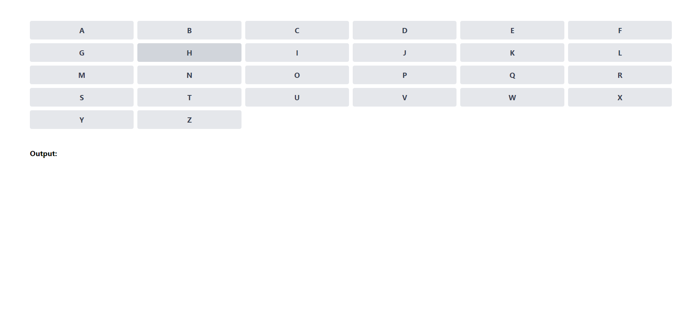

# Alphabet Tile Interaction

This React application displays a grid of tiles, each representing a letter of the alphabet in uppercase format. It includes functionality to append clicked letters to a string and replace consecutive letters according to specified rules.

# Static Image



## Features

1. **Tile Rendering**: Renders a tile for each letter of the alphabet (A to Z) within a container.
2. **Click Interaction**: When a tile is clicked, the corresponding letter is appended to a string displayed in an HTML element with the ID `outputString`.
3. **Consecutive Letter Replacement**: If three consecutive letters in the `outputString` are the same, they are replaced with an underscore (`_`). For example, if the user clicks "A", "B", "C", "F", "F", "F", "G" in that order, the `outputString` should display `ABC_G`.
4. **Multiple Consecutive Letters**: If more than three consecutive letters are the same, they are replaced with the appropriate number of underscores. For instance, if the user clicks "A" six times followed by "B", the `outputString` should display `_B`.

## Example Output

- Initial state: `outputString` is empty.
- After clicking "A", "B", "C", "F", "F", "F", "G": `outputString` displays `ABC_G`.
- After clicking "A" six times followed by "B": `outputString` displays `_B`.

## Installation and Setup

1. **Clone the repository**:
   ```sh
   git clone https://github.com/Taufiqul7756/frontend-task.git
   cd alphabet-tiles
   ```
2. **Install dependencies:**:
   ```sh
   npm install
   ```
3. **Run the application:**:
   ```sh
   npm start
   ```
