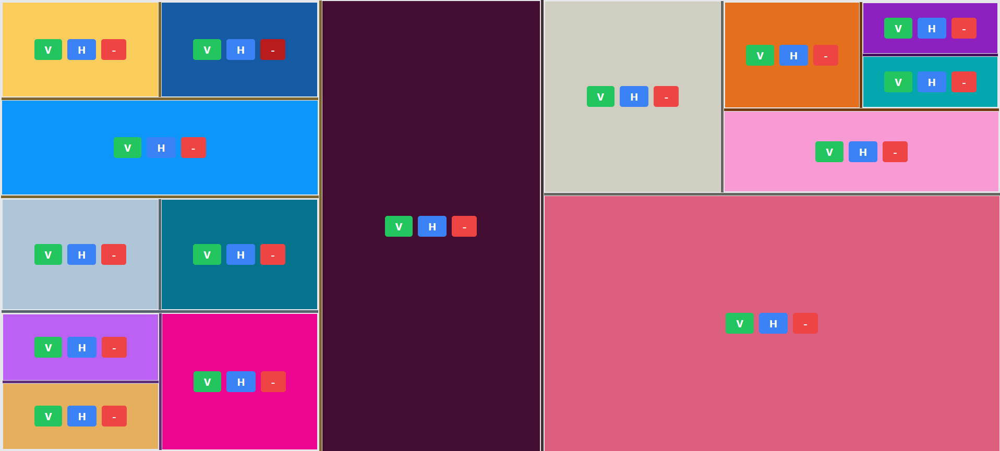

# Recursive Partitioning

This React application allows users to create a responsive layout by splitting partitions vertically and horizontally. Each partition can be further split, resized, and removed, allowing for a dynamic and customizable layout.

# Static Image




## Features

1. **Initial Partition**: Displays an initial partition with a random color and two buttons named "V" and "H".
2. **Vertical Split**: Clicking the "V" button will split the partition vertically.
3. **Horizontal Split**: Clicking the "H" button will split the partition horizontally.
4. **Color Retention**: After the split, one partition retains the old color, and the new partition gets a new random color.
5. **Recursive Splitting**: New partitions created via splitting can also be further split.
6. **Partition Removal**: Any partition can be removed via a button.
7. **Resizable Partitions**: Partitions can be resized by clicking and dragging (80% Done)
8. **Snap Ratios**: Partitions can snap to 1/4, 1/2, and 3/4 ratios when resized.

## Example Output

- Initial state: One partition with "V" and "H" buttons.
- After clicking "V" or "H": The partition splits into two.
- Further splitting and resizing are possible, and partitions can be removed.

## Installation and Setup

1. **Clone the repository**:
   ```sh
   git clone https://github.com/Taufiqul7756/frontend-task
   cd recursive-partitioning
   ```
2. **Install dependencies:**:
   ```sh
   npm install
   ```
3. **Run the application:**:
   ```sh
   npm start
   ```
